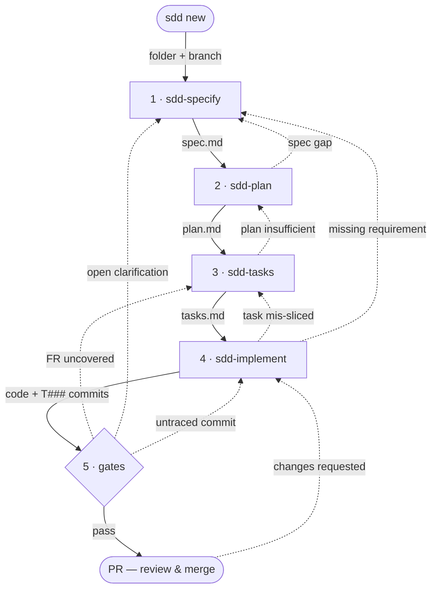

# sdd-toolkit

A spec-driven development toolkit for Claude Code. It adds an **artifact
contract** — feature folders, template-rendered documents, trace IDs, and
machine-checked gates — on top of a set of reusable reasoning skills (grilling,
domain modelling, TDD, review). Consistency stops being a model behaviour and becomes a
property of templates + scripts.

Installed as a `uv` tool — a `sdd` CLI that scaffolds itself into an existing repo.

## Install into an existing repo

Install the `sdd` CLI once (persistently, so the skills and gates can call it),
then scaffold it into your repo:

```bash
uv tool install git+https://github.com/kklasing/sdd-toolkit
uv tool update-shell   # first time only: puts ~/.local/bin on PATH (restart your shell after)

cd your-repo
sdd init --here
```

Use `uv tool install`, not `uvx`: the toolkit's skills (`sdd-specify`, `sdd-plan`,
…) and gates invoke `sdd new` / `sdd lint` / `sdd trace-check` throughout the loop,
so `sdd` has to stay on your PATH. `uvx` only runs a command once and discards the
environment — fine for a one-off, but it never installs `sdd`.

`sdd init` scaffolds (idempotently — re-runs preserve your edits):

```
.sdd/
  memory/constitution.md          # your machine-checked rules (author via sdd-constitution)
  templates/                      # spec / plan / tasks / research / data-model / decisions / evidence
  sdd.manifest.json               # hash manifest for safe upgrades
.claude/skills/
  sdd-grill-with-docs/  sdd-domain-modeling/  sdd-to-spec/                          # thinking skills
  sdd-constitution/  sdd-specify/  sdd-plan/  sdd-tasks/                            # artifact orchestration
  sdd-tdd/  sdd-review/  sdd-implement/                                             # implementation
  sdd-setup-tooling-node/                                                          # optional · Node.js project bootstrap
.github/
  workflows/sdd.yml               # runs `sdd lint` + `sdd trace-check`
  pull_request_template.md        # human-reviewer attestation
docs/agents/issue-tracker.md      # config consumed by sdd-review
specs/                            # feature folders land here
```

## Updating an existing install

Updating is two steps: upgrade the CLI, then re-scaffold the repo. First pull the
latest `sdd`:

```bash
uv tool upgrade sdd-toolkit
```

Then re-run `sdd init` in a repo that already has the toolkit to refresh its
templates, skills, and workflow:

```bash
sdd init --here
```

It's manifest-guarded, so a re-run is safe:

- **unchanged toolkit files** are refreshed to the new version;
- **files you've edited** (constitution, and anything else you've touched) are
  left alone and reported as skipped — add `--force` to overwrite them;
- the run prints the version transition (e.g. `0.1.0 → 0.2.0`).

Check what you're on at any time:

```bash
sdd version   # CLI version + the contract version stamped in this repo's manifest
```

When the two differ, a re-run of `sdd init` brings the repo's contract up to the
CLI you're invoking. Pin a specific release with
`uv tool install git+https://github.com/kklasing/sdd-toolkit@vX.Y.Z`.

## Set up once: the project foundations

Two project-level artifacts live side by side under `.sdd/memory/` and are read
throughout the loop — the **constitution** (the rules) and the **glossary** (the
vocabulary). Both are cross-cutting and project-scoped, but they have different
lifecycles: the constitution is versioned *law* you gate against; the glossary is a
*living reference* you consume.

**`.sdd/memory/constitution.md` — the rules.** `sdd init` drops a **placeholder**
constitution — the machine-checked rules `sdd-plan` gates every plan against.
Before your first feature, author it with the `sdd-constitution` skill: it fills the
placeholders from you and the repo, makes each rule declarative and testable, and
stamps a semantic version + Sync Impact Report into the `## Governance` block.
Re-run it whenever the rules change — it versions amendments (MAJOR/MINOR/PATCH)
rather than silently editing law. This is a project-level step, not per-feature; the
per-feature loop below assumes it's done.

**`.sdd/memory/context.md` — the glossary.** The project's ubiquitous language: a
tight glossary of domain terms that keeps `spec.md`, `data-model.md`, tests, and
code speaking the same words. Unlike the constitution it isn't scaffolded or gated —
the `sdd-domain-modeling` skill creates and sharpens it **lazily**, writing a term
down the moment it's resolved during grilling or planning. Multi-context repos swap
it for a `.sdd/memory/context-map.md` pointing at per-module `src/*/context.md`
glossaries. Read for vocabulary everywhere; never a spec or a scratch pad.

**Node.js projects (optional):** `sdd-setup-tooling-node` bootstraps the baseline
dev tooling — ESLint (flat config) + Prettier, Husky hooks, commitlint, release-please,
GitHub CI, Dependabot, Semgrep and a coding-standards index against the Sunbytes
`engineering-standards` baseline, `fallow` codebase intelligence, and a Vitest +
Playwright test stack. It's language-specific (the rest of the toolkit is
language-agnostic) and orthogonal to the loop — run it once when bootstrapping a
Node.js repo, or skip it entirely.

## The loop

One feature runs top-to-bottom through `specs/NNN-slug/`. The **happy path** is the
solid arrows; the **dashed arrows** are the step-backs — when a later phase exposes
a gap, you return to the phase that owns the fix and the trace IDs keep everything
aligned.

Each box is the skill you invoke; the label on each **solid** arrow is what that
phase produces and the next one reads — usually the `.md` it writes. **Dashed**
arrows are the step-backs, each labelled with what triggers it.



### `sdd new "<title>"` — start a feature

The one CLI step. Allocates the next `NNN`, slugifies the title, renders the
templates into `specs/NNN-slug/`, and creates + checks out the branch (branch ==
folder). Everything after this is driven by skills inside Claude Code.

### 1. `sdd-specify` — write the spec

Composes two component skills: `sdd-grill-with-docs` (a relentless interview that
also captures ADRs and glossary terms) then `sdd-to-spec` (explores the repo,
fixes the testing seams, writes the `FR-###` requirements into `spec.md`, and
validates them). Genuine unknowns become `[NEEDS CLARIFICATION]` markers (max 3)
you resolve before moving on. You can also run `sdd-to-spec` on its own to
synthesise a spec from a conversation you've already had, skipping the grilling.

### 2. `sdd-plan` — design the approach

Reads `spec.md` and the constitution and produces `plan.md` with a mandatory
**Constitution Check** (PASS/DEVIATION per rule). It dispatches research subagents
into `research.md` and sharpens the domain (`sdd-domain-modeling`) into
`data-model.md` / `contracts/` as the feature warrants. Deviations are logged in
`decisions.md`.

### 3. `sdd-tasks` — break it into tasks

Turns `plan.md` into `tasks.md`: dependency-ordered, MVP-first, **every `FR-###`
covered by ≥1 task**, each task a **vertical slice** (one behaviour through its
layers, with its test) in the `T### → Traces/Files` format.

### 4. `sdd-implement` — build it

Works `tasks.md` task by task, dispatching subagents that build TDD-first
(`sdd-tdd`) at the agreed seams and committing each as `T###:`, then fans out
`sdd-review` subagents across the Standards (constitution) and Spec (`FR-###`)
axes.

### 5. Gates & PR

`sdd lint` and `sdd trace-check` run locally and in CI (see [The gates](#the-gates)).
A green run plus human review on the PR — with the constitution attestation in the
PR template — closes the loop.

### Stepping back

The dashed edges above: planning can send you back to the spec (`spec gap`); a
mis-sliced task back to `sdd-tasks`; a **missing requirement** surfaced during the
build all the way back to `sdd-specify`; and a **failing gate** back to whichever
phase owns the fix — an uncovered FR to `sdd-tasks`, an open clarification to
`sdd-specify`, an untraced commit to `sdd-implement`. Because every artifact is
traced, stepping back is cheap: edit the earlier file and re-run forward.

## The gates

```bash
sdd lint          # required files exist · every FR covered by ≥1 task · no open [NEEDS CLARIFICATION]
sdd trace-check   # every branch commit carries its task id (T###: or feat(T###):)
```

Both run in CI via `.github/workflows/sdd.yml`. They are the enforcement layer —
skills only bias, gates decide.

## The trace

`FR-###` (spec) → `T###` (task, with file paths) → `T###:` (or `feat(T###):`)
commit → branch = feature folder. An auditor asking "where was requirement X specified,
implemented, tested and reviewed?" gets a grep, not a story.

## Two-tier decisions

- `docs/adr/NNNN-slug.md` — repo-wide architectural decisions (via `sdd-domain-modeling`).
- `specs/NNN-slug/decisions.md` — feature-local deviations from the plan;
  anything architecturally significant is promoted to an ADR and linked.

## Roadmap (v2)

- `sdd sync` — generate GitHub issues from `tasks.md`, write issue numbers back.
- `sdd evidence` — generate `evidence.md` from git + CI metadata at review time.
- A `handoff` skill; multi-agent support (`AGENTS.md`) beyond Claude Code.

## Development

```bash
uv venv && uv pip install -e ".[test]"
uv run pytest
```

Enable the commit-message hook once per clone so your commits stay Conventional
Commits (required for correct changelogs — see [Releases](#releases)):

```bash
uv run --extra dev pre-commit install --hook-type commit-msg
```

After that, `git commit` rejects any message that isn't a valid Conventional
Commit. The rule set is `.pre-commit-config.yaml`.

Assets live in `assets/` and are bundled into the wheel at
`sdd_toolkit/core_pack/` (see `pyproject.toml`). The CLI resolves the bundled
pack when installed, or `assets/` when run from a source checkout.

### Releases

Versioning is automated with
[release-please](https://github.com/googleapis/release-please). Commit with
[Conventional Commits](https://www.conventionalcommits.org) (`feat:`, `fix:`,
`feat!:`/`BREAKING CHANGE:`) and, on every push to `main`, the action maintains a
**release PR** that bumps `version` in `pyproject.toml` and updates
`CHANGELOG.md`. Merging that PR tags the commit and publishes the GitHub Release —
no manual version edits. The version release-please stamps is what `sdd version`
and the install manifest report.
